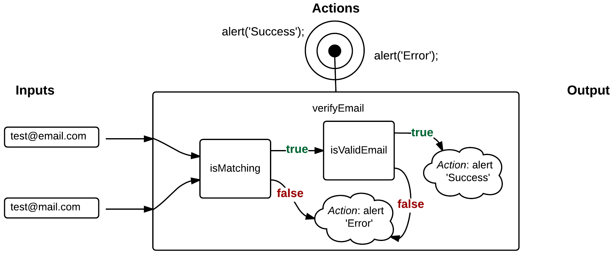

# Intro to Functions
The building blocks for ALL programs. ANY calculations that you do in your code should be a function.

## Functions Conceptually

### The Concept
Functions take inputs and either outputs data or performs actions

### Ex 1
In this example we have a function `multiply()` that takes 2 inputs and gives 1 output.

### Ex 2
In this example we have a function `verifyEmail()` that takes 2 inputs and and performs some actions.


## Function Declaration Syntax
### Style 1
```javascript
// Style 1
function functionName(args, params) {
  // Function Body
}
```
### Style 2
```javascript
// Style 2
var functionName = function(args, params) {
  // Function Body
};

```

You need to know both.

## Getting Data out of a Function
We get data out of a function by using the `return` keyword. The value of the return will be returned to where we called the function.

## Calling a Function
You call a function by using the name followed by parens.
### Example
```javascript
function sum(a, b) {
  return a + b;
}

var total = sum(3,6);
```
