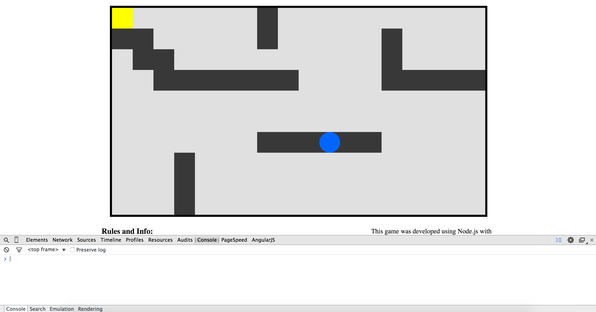

Weekend Exercise 3 -- Maze Game
================================
Developed by Derek Argueta

The exercise for this weekend is to create a first-person game where the user
controls a little blue circle that can navigate through a maze of walls which it
cannot cross, use a portal to get to the other side of the screen, be killed by
'danger blocks', and ultimately reach an endpoint at which the user wins the
game. No big deal, right? So let's get started!!


In cloning the repo, you should have an index.html, some javascript files, and
a style.css. You won't need to worry about CSS. We will have to modify the
index.html just a bit, but most of this lab will be JavaScript.


<h2>Step 1 - Hooking Things Up</h2>
This step should be quite simple for you. All you need to do is link the
JavaScript into the index.html file using the `<script>` tag. Link the
JavaScript files in the following order:
- lib.js
- player.js
- wall.js
- init.js
- statusCheck.js
- keyboard.js

Because we make use of global variables, linking them in a different order may
cause errors. You can verify that they were linked correctly by making sure
there's no errors in the console. You can also click on the "networks" tab in
the Chrome dev tools and check that each file was loaded in.

================================================================================================
================================================================================================

================================================================================================
================================================================================================

<h2>Step 2 - The Arrow Keys</h2>
Games are typically played with keyboard keys, especially arrow keys. If our
game is going to beat Call of Duty, we probably should utilize arrows as well.
Pop open keyboard.js. Take a moment to read the comments so that you understand
the initial code that is there.

... Done? Cool.

Now here is a structure we haven't seen before - a Switch-Case.
Switch-cases are actually quite simple, very similar to if-statements. Here we
pass in e.keyCode, which is the number value of the key that was pressed. If it
matches any of the 'cases' (37, 38, 39, 40), then it will execute the code
following it up to `break`. The reason a switch-case was used here is because it
looks a lot more clean than
```javascript
if(e.keyCode == 37) {
    // left arrow
} else if(e.keyCode == 38) {
    // up arrow
} else if(e.keyCode == 39) {
    // right arrow
} else if(e.keyCode == 40) {
    // down arrow
} else {
    // not an arrow
}
```
If your conditional only has 2 or 3 cases, then an if-statement or if-else
statement would be perfectly fine.

And as you might've guessed, the special number for the
left key is 37, up key is 38, etc.

Put a `console.log()` under each case saying something like "left key pressed",
"right key pressed", etc. Then run your app in the browser with the console open.
When you press the arrow keys, you should see print-outs in the console.

Pretty cool, huh?


Last thing we want to do is prevent the browser from scrolling up/down when we
press the up/down keys on our keyboard. The browser does this because it is the
default behavior. We can prevent the default behaviour by entering
`e.preventDefault()` on the first line under each case.

================================================================================================
================================================================================================

================================================================================================
================================================================================================

<h2>Step 3 - Moving the Player</h2>
Open up player.js.

First thing is first. We need to define `self`. Self should be equivalent (=) to the
DOM ~element~ with an ~ID~ of 'block', so that in the move functions when we grab
the `left` and `top` properties of the blue circle, we can just use `self`
instead of re-grabbing the ~element~ from the ~document~.

(~~ indicates a hint...)

This file defines a Player object which already has its move
functions scaffolded out. Now we need to fill them in. Thankfully, I wrote a
little animation library for you that you can use to animate the player in
lib.js. The functions are
```
function animateLeft(obj, callback) {
    // ...
}

function animateRight(obj, callback) {
    // ...
}

function animateUp(obj, callback) {
    // ...
}

function animateDown(obj, callback) {
    // ...
}
```
where obj is the DOM element you are animating (the player) and callback is a 
function that will be executed when the animating is done.

Use those functions where they should belong (i.e. `animateLeft` in `moveLeft`)
inside of `if(!animating){ //... }` and right under `animating = true;`. Now the function has two parameters, the
element we're animating and a callback to be executed after animation. For the 
object being animated, we can just use `self` since we already got the ~element 
by its ID~. The second parameter is going to be the function `moveCallback` which
is already defined. All it does for now is set `animating` to `false` so that the
rest of the program knows we're not in animation and can accept new animations.

Now the player isn't going to move quite yet because it hasn't been connected to
keyboard.js. When we hit arrow keys, we still only get print-outs. Under each 
respective case we need to animate the player object. But before we can do that,
we must create an actual player to use! Player() is just a layout for a player object
but doesn't actually instantiate one. In init.js, create a new player object called
`player` at the very top. <a href="https://developer.mozilla.org/en-US/docs/Web/JavaScript/Guide/Working_with_Objects" target="_blank">Help with objects</a>

Now that we have this player object to use, we can call player.move... under each
case in keyboard.js so that when a certain arrow gets hit, the player moves in that
respective direction. Example:
```javascript
switch(e.keyCode) {

    // Left arrow was pressed
    case 37:
        e.preventDefault();
        player.moveLeft();
        break;

    //...
    //...
    //...
}
```

If everything is done correctly, you should be able to move the blue circle
around!

================================================================================================
================================================================================================

================================================================================================
================================================================================================

<h2>Step 4 - Sweet, sweet victory</h2>
Games are no fun if you can't win, right? (*cough* *cough* <b>flappy bird</b> *cough* *cough*)
Let's add some code so that when the user steps on the yellow square, victory is
indicated.

First, call `checkStatuses()` in `moveCallback()` in player.js. What this does is
after every move animation, it will check the various statuses of the player object
such as whether the player won or lost. This is possible because if you look in statusCheck.js
all the different 'check' functions are wrapped in one big function called `checkStatuses()`
so that we don't have to call each 'check' function individually.

Now in statusCheck.js check out the `checkWin()` function. It's empty!
Write some code here so that if the yellow square and blue circle are on the same
tile, then a pop-up with a victory message appears, followed by the browser
refreshing. And yes, your JavaScript must refresh the browser programmatically.

*hint*: You can check if two items are on the same tile by checking if their
`left` and `top` style properties are the same. Now, to figure out how to access
those properties of a DOM element.... What, did you think I was going to hold your
hand the whooolle time?

If you did this step properly you should get the following:


================================================================================================
================================================================================================

================================================================================================
================================================================================================

<h2>Step 5 - The Background</h2>
OK take a deep breath because this step is probably the hardest.

Ready?

Ok

We need to "register" every tile in the background so that we can then easily
manipulate it with JavaScript and turn cells into walls or portals programmatically.
We *could* do this by writing a ton of HTML (Almost the same line nearly 200 times)
but we can accomplish the same thing in about 30 lines of JavaScript with a little
ingenuity and craftiness.

Open up init.js. This is the file we're going to use for most of our 'set-up'
code. Go to the `createBackground()` function which is... surprise, surprise, very
much empty. Here's the requirements for this function

- it must create a new div for every 'tile' in the game's grid by iterating from 0 to
CAGE_SIZE (which is equal to 180 as you can see if you scroll up in init.js)
- In each iteration, create a new div element.
  - Give that div element a `className` of "empty square". This will give it the
  appropriate CSS.
  - Now give it an ID equivalent to that of the current iteration number. So for
  example, if you're on the fifth iteration of the for-loop, the ID should be 5.
  On the next iteration the ID should be 6. This will provide each div with a unique
  numerical ID that *also* corresponds to its location on the grid. Pretty crafty, huh?
  - We also need to provide the div with a location. We do this by setting the 
  `left` and `top` style properties of this new div.
    - For the `left` value, it should start at `0px` for the first element but
    increase by 50 with every subsequent element. *HOWEVER* it *must* be set back
    to 0 for every 19th element. There are 18 tiles in each row of the game's grid.
    If we don't reset the `left` value to 0, then it will keep growing and the tiles
    will go off of the screen.
    - We need to do the same thing with the `top` value. It must start at 0 and
    every time we hit a new 'row' (18 tiles) we need to increase the top value by
    50
    - i.e the 20th iteration should make a tile that has a `left` value of 50px and
    a `top` value of 50px. because it is in the second tile of the second row. The
    5th iteration should create a div with a `left` value of 200px because it is the
    5th div (0px, 50px, 100px, 150px, *200px*) and a `top` value of 0px because it
    is in the first row.
  - lastly, append that div as a child to the div that has an ID of 'cage'. This will put it in
  the black-bordered box AKA our game area.

*hints*: The modulus operator (%) can be used to calculate divisibility. % in place
of the division operator will give you the *remainder* of the division.
```javascript
var testOne = 5 % 4;    // this gives you 1 because that's the remainder when you divide 5 by 4
var testTWo = 500 % 200; // this gives you 100 because 500 / 200 is 2 with a remainder of 100
// so...
if(x % 5 == 0) {
    // This checks if x is divisible by 5 because if it is, then the remainder is 0
}
```
You can use this new information about the modulus operator to check if you 
need to 'start' a new row of divs in your for-loop. Every row is has 18 divs... So if a certain number
is divisibly by 18 then you need a new... NO WAIT I'VE SAID TOO MUCH!

If you wrote the algorithm correctly you should see this:


Ready for the magical part?

'Inspect element' on any of the grey background tiles.


That nifty for-loop you did generated <b>*180 divs*</b> each with a unique numerical ID and a unique positioning.

================================================================================================
================================================================================================

================================================================================================
================================================================================================

<h2>Step 6 - YOU SHALL NOT PASS</h2>
Ok so we can move our player around and we have a background where each tile can
be accessed through a unique ID. Time to make some walls. In init.js you'll see
a variable called levelDefinition containing a dictionary. One of the dictionary
items is called 'walls' and consists of a big array of numbers. These numbers are
actually the divs of the background tiles we want to change to walls. By setting
up the walls this way, we can easily change which tiles we want to act as walls
simply by changing what numbers are in this array.

Now let's actually build some walls. Go to wall.js and inside the *constructor*
(`Wall(id)`) there's a spot for you to add some code. Assign `obj` to the document
element that has the ID of the parameter `id`. That parameter is the CSS ID of the
div that we want to turn into a wall. Then, give `obj` a `className` of "wall square"
so that it'll be styled appropriately.

After you've complete the function, we need to fill out `Wall.createWalls()` so
that it will build walls with the array of id's being passed in. Create a for-loop
that iterates through that array. For every array in that ID, create a new `Wall`
object with that ID as that parameter. All the new `Wall` objects should be 
collected into an array, which is returned after the for-loop is done using the
`return` keyword.

With the walls, your screen should look like this:


Wait a sec.... Houston, we have a problem....


What's the point of a wall if you can pass right through it??? This needs to be fixed...

So this'll be tricky. Open player.js and you'll see some commented space in each move
function labelled 'STEP 6' use this area to write code that will check if the current
player is next to a wall using `left` and `top`. If so, flip wallPresent to `true`
so that the moving animation will not execute.

*hints*:

- If you did the first part in wall.js correctly, then the variable `wallObjs`
in init.js should be an array of all the wall objects. Iterate through this array
to check each wall piece individually. You can just use `wallObjs` as is because it
is a global variable.

- Also, on certain lines you'll have to convert the `left` or `top` value to a number.
Do this using the <a href="https://developer.mozilla.org/en-US/docs/Web/JavaScript/Reference/Global_Objects/parseInt" target="_blank">`parseInt()`</a> function that's built into JavaScript.

================================================================================================
================================================================================================

================================================================================================
================================================================================================

<h2>Step 7 - Do you believe in magic?</h2>
Alright now lets build the portals!! The portals are actually quite simple, and you
can actually recycle some of the concepts you use with the victory square. If the
player enters a portal, change the player's `left` and `top` properties to match
the *other* portal, placing the player in the same tile as the other portal, or,
well, 'teleporting' the player over.

Firstly, we need to create the portal divs so they show up. As you can see in
levelDefinition, there's also an array that lists the two spots where we want
the portals to be. Go to init.js and scroll down to `createPortal()`. This function
takes in a pair of portals and creates the proper DOM element. Create two new
document elements with the ids that were passed in as parameters. Then give those
elements a `className` of "portal square".

And your screen should now look like this:


Now go to statusCheck.js and scroll down to `checkInPortal()`. This function
should iterate through the portals in the `portals` array to check if the player
is currently in the same location as either of the portals. If so, then change
the players `left` and `top` values to match the *other* portal, thus teleporting
the player. Pretty straightforward, right?

If you wrote your `checkInPortal()` correctly, then when you move your player into
one pink square it should *magically* teleport to the other and vice versa.

================================================================================================
================================================================================================

================================================================================================
<p>(pardon the mispelling of programmer... I didn't make it...)</p>
================================================================================================

<h2>Step 8 - Trouble with a capital T, that rhymes with P and that stands for Pool!</h2>
Ok time for the last piece: the danger blocks. The danger blocks are the red
squares that spawn at a *random* location on the grid every three turns. If the
player enters the same space as the danger block, then game over.

Head over to `randomDanger()` in init.js. This function will generate the random
danger blocks. Start off by generating a random *integer* that is between 0 and
`CAGE_SIZE`. If the number generated is a) the id of a block that already is a 
danger block, b) the id of a portal, or c) the id of a wall, then you need to
get a new random number because our danger blocks can't be on top of existing
blocks. Then, get the background element that has that id and assign it a 
`className` of "danger square". This will give it the appearance of a danger block.
Lastly, `push` this id onto the `dangerous` global array.

Now if you play the game, nothing happens because `randomDanger()` isn't being
called anywhere. Go to keyboard.js.

You'll see some space commented out for step 8. Here you need to do a nifty
if-statement that checks two things.
- Checks if the key pressed was an arrow key (this entire onKeyDown gets fired
for *any* button so we need to be sure it was an arrow key)
- If it's the 3rd turn. We have a global `turnNumber` variable in init.js that gets
incremented in statusCheck.js, so all we need to do to verify that it is a third
turn is check if `turnNumber` is divisible by 3.
If the two conditions are met, then you should call `randomDanger()` that you
just filled out in init.js.

Now if you start moving your player around you should see the random danger squares
generate periodically. But they're actually not dangerous yet. They're just
random squares. We still need to add code to check if the player actually enters
a danger square.

In statusCheck.js, there's a function called `checkLoss()` that needs to be filled out.
As you probably guessed, this is going to check the location of our player against
the location of all the random danger blocks, accessible via the `dangerous` array
from init.js. If a match is found, give an `alert` indicating that the player lost
and refresh the page, like you did with when the player wins.

AND THAT'S IT!!

================================================================================================
================================================================================================

================================================================================================
================================================================================================

<h2>Bonus</h2>
Wanna go above and beyond? Here's some ideas if you really want to push yourself
on this project:
- Rather than having the danger blocks appear every 3 turns, have them appear
every 3 *seconds*, regardless of whether the player moves or not.
- When the player hits victory, the pop-up should show how long it took the
player to complete the level.
- Make it a multi-level game! You'll need to have a dictionary for every level
to define where the walls/portals are and refactor init.js a bit.
- Enable multiple portals. When you enter one, you get sent randomly to one
of the others.